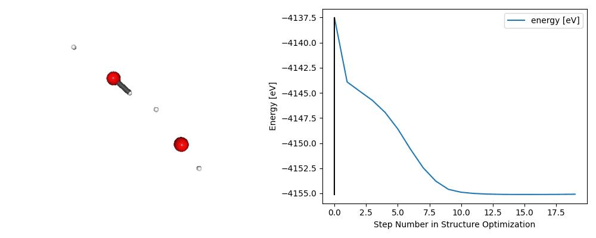

:red_circle: :warning: **Experimental and non-official Graphcore product** :warning: :red_circle:

# nanoDFT 
 
Hackable DFT implementation made <b>by</b> machine learning researchers <b>for</b> machine learning researchers. nanoDFT tries to be small, clean, intepretable and educational.


### Minimal Working Example 
```
python nanoDFT.py --structure_optimization True
```


