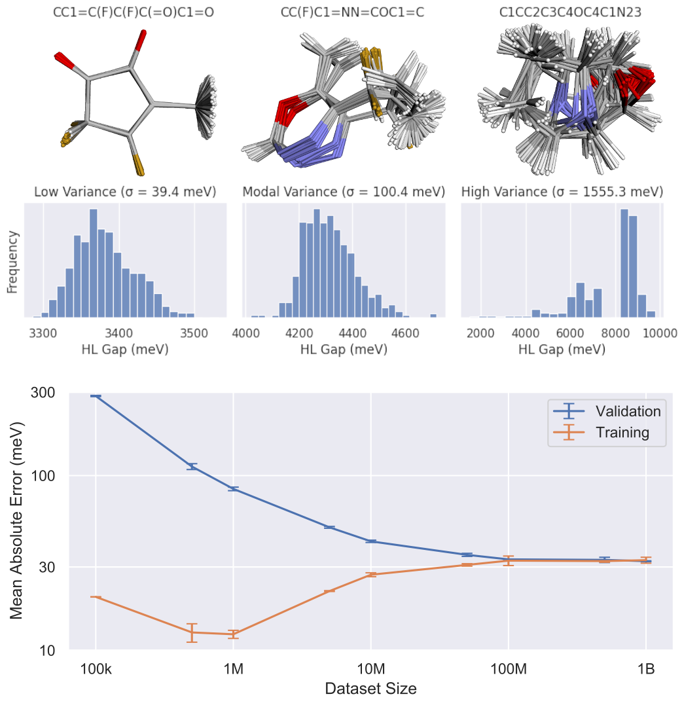

# Training SchNet on QM1B

This repository contains the implementation of the SchNet 9M trained on the QM1B
dataset. We show that training a SchNet 9M model to predict HL gap shows improvement as
the number of training samples approaches 500M.



## Requirements
This project requires requires Python 3.8, and Graphcore SDK 3.2.  Additional
dependencies can be installed into your environment with
```bash
pip install -r requirements.txt
```

## Training SchNet

```bash
python train.py
```

## Downloading QM1B
The QM1B dataset is stored in multiple Apache Parquet files and can be downloaded
locally using:
```bash
python download.py /path/for/qm1b
```
This is required for running the training script.
> **Note** 
> this will require at least 240GB of storage.


## Complete Training Usage
Complete usage is documented below.

```bash
python train.py --help
usage: train.py [-h] [--config CONFIG] [--print_config[=flags]] [--seed SEED] [--learning_rate LEARNING_RATE]
                [--learning_rate_decay LEARNING_RATE_DECAY] [--update_lr_period UPDATE_LR_PERIOD]
                [--val_period VAL_PERIOD] [--pop_config CONFIG] [--pop_config.device_iterations DEVICE_ITERATIONS]
                [--pop_config.replication_factor REPLICATION_FACTOR]
                [--pop_config.gradient_accumulation GRADIENT_ACCUMULATION] [--pop_config.optimize_popart {true,false}]
                [--pop_config.cache_dir CACHE_DIR] [--pop_config.quiet {true,false}]
                [--pop_config.offload_optimizer_state {true,false}] [--pop_config.pipeline_splits PIPELINE_SPLITS]
                [--pop_config.available_memory_proportion AVAILABLE_MEMORY_PROPORTION]
                [--pop_config.use_stochastic_rounding {true,false}] [--data_config CONFIG] [--data_config.dataset DATASET]
                [--data_config.num_workers NUM_WORKERS] [--data_config.num_train NUM_TRAIN]
                [--data_config.num_test NUM_TEST] [--data_config.max_num_examples MAX_NUM_EXAMPLES]
                [--data_config.root_folder ROOT_FOLDER] [--data_config.shuffle {true,false}] [--model_config CONFIG]
                [--model_config.num_features NUM_FEATURES] [--model_config.num_filters NUM_FILTERS]
                [--model_config.num_interactions NUM_INTERACTIONS] [--model_config.num_gaussians NUM_GAUSSIANS]
                [--model_config.k K] [--model_config.cutoff CUTOFF] [--model_config.batch_size BATCH_SIZE]
                [--model_config.use_half {true,false}] [--model_config.recomputation_blocks RECOMPUTATION_BLOCKS]
                [--debug {true,false}] [--wandb_project WANDB_PROJECT] [--use_wandb {true,false}]
                [--only_compile {true,false}] [--warmup_steps WARMUP_STEPS] [--wandb_warmup {true,false}]

Minimal SchNet GNN training

optional arguments:
  -h, --help            Show this help message and exit.
  --config CONFIG       Path to a configuration file.
  --print_config[=flags]
                        Print the configuration after applying all other arguments and exit. The optional flags customizes
                        the output and are one or more keywords separated by comma. The supported flags are: comments,
                        skip_default, skip_null.
  --seed SEED           the random number seed (type: int, default: 0)
  --learning_rate LEARNING_RATE
                        the learning rate used by the optimizer (type: float, default: 0.0005)
  --learning_rate_decay LEARNING_RATE_DECAY
                        exponential ratio to reduce the learning rate by (type: float, default: 0.96)
  --update_lr_period UPDATE_LR_PERIOD
                        the number of steps between learning rate updates. Default: 32*300*batch_size = 36M so lr is
                        increasing 0 to 4M warmup, then decreasing every 36M steps (1000/36 ~ 30 times) (type: int,
                        default: 9600)
  --val_period VAL_PERIOD
                        number of training steps before performing validation (type: int, default: 4000)
  --debug {true,false}  enables additional logging (with perf overhead) (type: bool, default: False)
  --wandb_project WANDB_PROJECT
                        (type: str, default: schnet-9m)
  --use_wandb {true,false}
                        Use Weights and Biases to log benchmark results. (type: bool, default: True)
  --only_compile {true,false}
                        Compile the and exit (no training) (type: bool, default: False)
  --warmup_steps WARMUP_STEPS
                        set to 0 to turn off. openc uses 2-3 epochs with 2-3M molecules => 4-9M graphs; => steps = 10M /
                        batchsize ~ --warmup_steps 2500 (type: int, default: 2500)
  --wandb_warmup {true,false}
                        enable wandb logging of warmup steps (type: bool, default: False)

configuration options for PopTorch:
  --pop_config CONFIG   Path to a configuration file.
  --pop_config.device_iterations DEVICE_ITERATIONS
                        (type: int, default: 32)
  --pop_config.replication_factor REPLICATION_FACTOR
                        (type: int, default: 16)
  --pop_config.gradient_accumulation GRADIENT_ACCUMULATION
                        (type: int, default: 1)
  --pop_config.optimize_popart {true,false}
                        (type: bool, default: True)
  --pop_config.cache_dir CACHE_DIR
                        (type: str, default: .poptorch_cache)
  --pop_config.quiet {true,false}
                        (type: bool, default: True)
  --pop_config.offload_optimizer_state {true,false}
                        (type: bool, default: False)
  --pop_config.pipeline_splits PIPELINE_SPLITS, --pop_config.pipeline_splits+ PIPELINE_SPLITS
                        (type: Union[List[int], null], default: null)
  --pop_config.available_memory_proportion AVAILABLE_MEMORY_PROPORTION
                        (type: float, default: 0.6)
  --pop_config.use_stochastic_rounding {true,false}
                        (type: bool, default: True)

options for data subsetting and loading:
  --data_config CONFIG  Path to a configuration file.
  --data_config.dataset DATASET
                        (type: str, default: qm9)
  --data_config.num_workers NUM_WORKERS
                        (type: int, default: 1)
  --data_config.num_train NUM_TRAIN
                        (type: int, default: 100000)
  --data_config.num_test NUM_TEST
                        (type: int, default: 20000)
  --data_config.max_num_examples MAX_NUM_EXAMPLES
                        (type: int, default: 1000000000)
  --data_config.root_folder ROOT_FOLDER
                        (type: Union[str, null], default: null)
  --data_config.shuffle {true,false}
                        (type: bool, default: True)

model arcitecture options:
  --model_config CONFIG
                        Path to a configuration file.
  --model_config.num_features NUM_FEATURES
                        (type: int, default: 1024)
  --model_config.num_filters NUM_FILTERS
                        (type: int, default: 256)
  --model_config.num_interactions NUM_INTERACTIONS
                        (type: int, default: 5)
  --model_config.num_gaussians NUM_GAUSSIANS
                        (type: int, default: 200)
  --model_config.k K    (type: int, default: 28)
  --model_config.cutoff CUTOFF
                        (type: float, default: 15.0)
  --model_config.batch_size BATCH_SIZE
                        (type: int, default: 8)
  --model_config.use_half {true,false}
                        (type: bool, default: False)
  --model_config.recomputation_blocks RECOMPUTATION_BLOCKS, --model_config.recomputation_blocks+ RECOMPUTATION_BLOCKS
                        (type: Union[List[int], null], default: null)
```